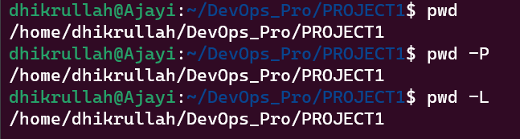
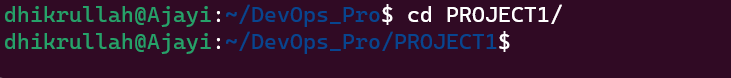
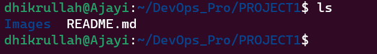
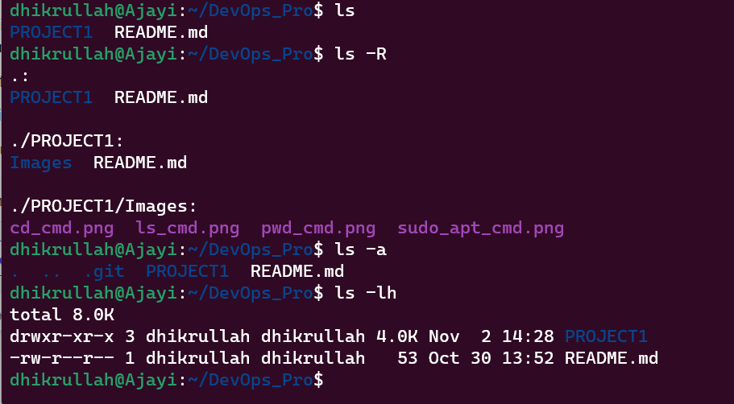
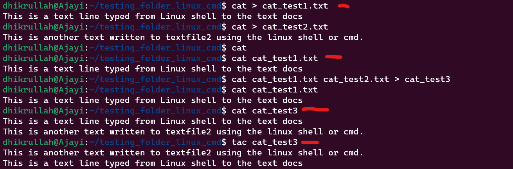
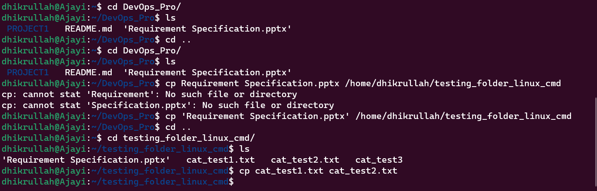
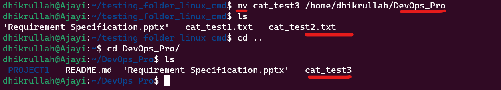
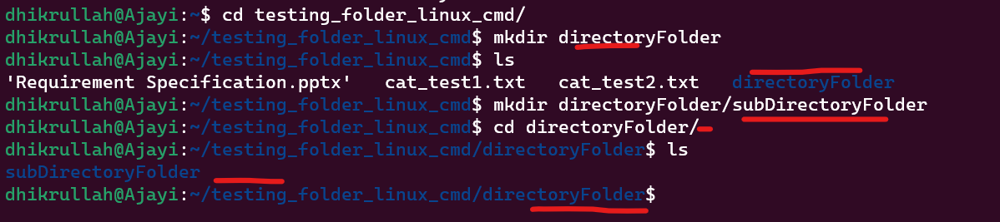
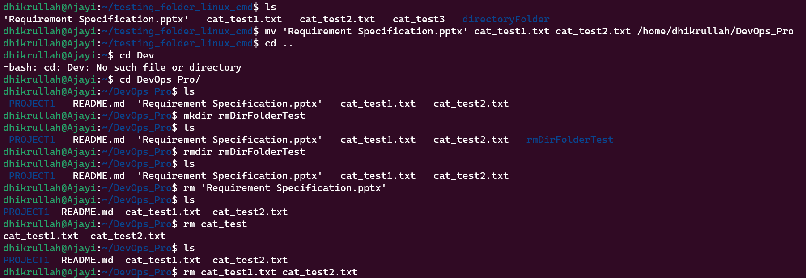
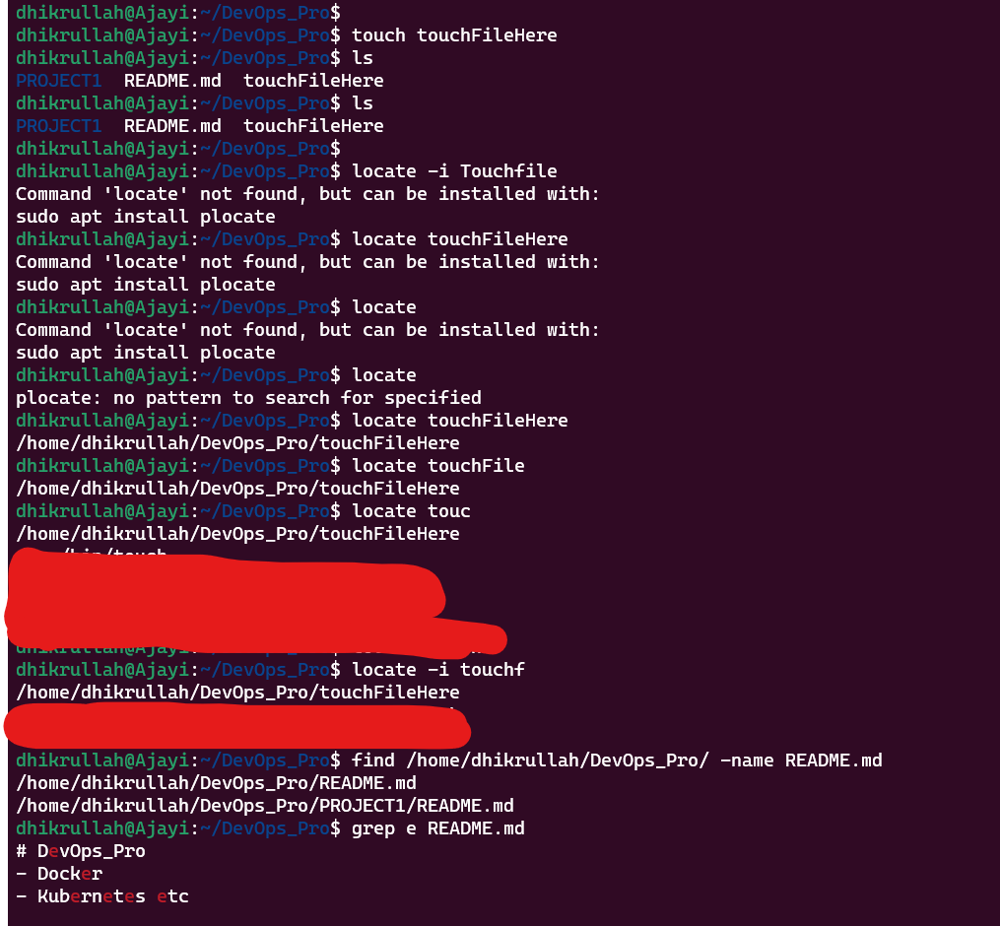

# LINUX COMMANDs DIR

## Pre-Requisite:

- Ubuntu Desktop Distribution Installed
- Local machine or web

## File Manipulation

1.  **Create a `sudo` command(superuser do)**
    
    Functions: Require to perform task that requires admin or root permissions and access.

    - Run `sudo apt upgrade` to upgrade to the latest version of Ubuntu.
    

2.  **Create `pwd` command**

    Functions: Required to find the path for the folder, file or application current/parent working directory or path.

    - Run `pwd` to determine the present working directory.

    - Run `pwd -p` to print the actual path of the working directory

    - Run `pwd -L` to print environment variable content, including symbolic links
    

3.  **Create `cd` command**

    Functions: required to navigate through files and directory, depends on the current directory.

    - Run `cd` to change the working directory

    - or Run `cd ubuntu` to switch the directory path
    

4. **Create `ls` command**

    Functions: required to list the item in the directory or contents

    The current working directoru is ~~dhikrullah@Ajayi:~/DevOps_Pro/PROJECT1$~~

    - Run `ls` to view or list the content of the directory.
    

    ```console
    - Run `ls -R` to list files in the sub-drectories
    - Run `ls -A` to show all hiddens files in addition to the visible ones.
    - Run `ls -lh` to show the files sizes in an easy readable formats with files types.
    ```
    

5. **Create `cat` command -> Concatenate**

    Functions: Requires to list, combine file content to the standard output and can merge files to another file.

    The current working directory is __dhikrullah@Ajayi:~/testing_folder_linux_cmd$__

    - Run `cat (filename.extension)`

    - i.e. `cat cat_test1.txt` to show the content in the text.

    __Another method__

    ```console
    cat [cat_test1.txt cat_test2.txt > cat_test3] //this merges files1, files 2 into files3.
    tac [cat_test3] //displays content in any specified files.
    ```
    

6.  ### **cp**:
    Cp is used to copy files or directories, this is majorly used every single day and almost every seconds to copy and paste text, files and folders.

    MV is used to move files/folders and text from one location to another.

    Adding flag `-R` copies/moves the entire directory, depending on the if you're `copying` or `moving` files, folders or text.

    - to copy files to a directory, enter the file names followed by the destination directory/folder.
    
    ```console
    cp ['Requirement specification.pptx'] to [/home/dhikrullah/testing_folder_linux_cmd]
    cp [cat_test1.txt to cat_test2.txt]
    ```
    

7.  ### **mv**:
    MV is used to move files/folders and text from one location to another.

    Adding flag `-R` copies/moves the entire directory, depending on the if you're `copying` or `moving` files, folders or text.

    ```console
    mv [file1 to another location] //mv cat_test3 to :/home/dhikrullah/DevOps_Pro
    ```
    

8.  ## **Create `mkdir` is used to create 1 or multiple directories/folders, which also set permissions for each of them**

    Functions: Required to make directory.

    **To make directory called *directoryFolder* in  /home/dhikrullah/testing_folder_linux_cmd run:**
    
    - Run `mkdir directoryFolder`
    
    *To make sub directory inside directory folder as shown above, do:*
    - Run `mkdir subDirectoryFolder`

    

9.  ### **rmdir, rm**:
    Rmdir is basically used to remove or permanently delete an empty director or path folder., Users must have some `sudo` priviledges to perform this action.

    Rm command is basically to delete files within some directory and users performing this actions should have `write` permissions too

    ```console
    rmdir rmDirFolderTest                                           //deletes sub-directory

    rm 'Requirement Specification.pptx'                             //delete a single file in directory
    rm cat_test1.txt cat_test2.txt                                  //delete multiple files in directory
    ```

    

10. ### **touch, locate, find, grep**:
    - Touch command is used to create a new file that is empty or also mofidy and generate a timestamp in linux cmd.
    
    - Find command is used to search for documents within specific directory or folders and perform operations. //[find] [option] [path] [expression]

    - Grep command is an acronym for global expression print used to find words by search all text in documents.

    ```console
    touch 
    locate -i //-i argument turns off case sensitivity, which means, you can search for files without the exact name.
    ```
    

11. 
