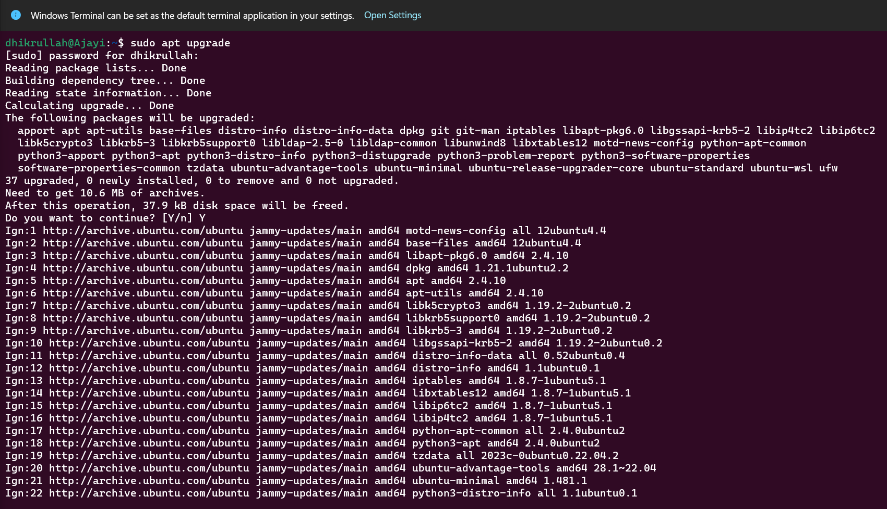

# LINUX COMMANDs DIR

## Pre-Requisite:

- Ubuntu Desktop Distribution Installed
- Local machine or web

## File Manipulation

1. **Create a `sudo` command(superuser do)**
    
    Functions: Require to perform task that requires administrative or root permission.

    - Run `sudo apt upgrade` to upgrade to the latest version of Ubuntu.
    