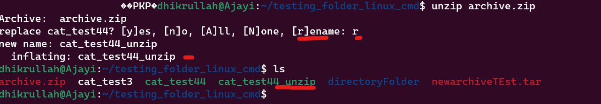

# LINUX COMMANDs DIR

## Pre-Requisite:

- Ubuntu Desktop Distribution Installed
- Local machine or web

## File Manipulation

1.  **Create a `sudo` command(superuser do)**
    
    Functions: Require to perform task that requires admin or root permissions and access.

    - Run `sudo apt upgrade` to upgrade to the latest version of Ubuntu.
    

2.  **Create `pwd` command**

    Functions: Required to find the path for the folder, file or application current/parent working directory or path.

    - Run `pwd` to determine the present working directory.

    - Run `pwd -p` to print the actual path of the working directory

    - Run `pwd -L` to print environment variable content, including symbolic links
    

3.  **Create `cd` command**

    Functions: required to navigate through files and directory, depends on the current directory.

    - Run `cd` to change the working directory

    - or Run `cd ubuntu` to switch the directory path
    

4. **Create `ls` command**

    Functions: required to list the item in the directory or contents

    The current working directoru is ~~dhikrullah@Ajayi:~/DevOps_Pro/PROJECT1$~~

    - Run `ls` to view or list the content of the directory.
    

    ```console
    - Run `ls -R` to list files in the sub-drectories
    - Run `ls -A` to show all hiddens files in addition to the visible ones.
    - Run `ls -lh` to show the files sizes in an easy readable formats with files types.
    ```
    

5. **Create `cat` command -> Concatenate**

    Functions: Requires to list, combine file content to the standard output and can merge files to another file.

    The current working directory is __dhikrullah@Ajayi:~/testing_folder_linux_cmd$__

    - Run `cat (filename.extension)`

    - i.e. `cat cat_test1.txt` to show the content in the text.

    __Another method__

    ```console
    cat [cat_test1.txt cat_test2.txt > cat_test3] //this merges files1, files 2 into files3.
    tac [cat_test3] //displays content in any specified files.
    ```
    

6.  ### **cp**:
    Cp is used to copy files or directories, this is majorly used every single day and almost every seconds to copy and paste text, files and folders.

    MV is used to move files/folders and text from one location to another.

    Adding flag `-R` copies/moves the entire directory, depending on the if you're `copying` or `moving` files, folders or text.

    - to copy files to a directory, enter the file names followed by the destination directory/folder.
    
    ```console
    cp ['Requirement specification.pptx'] to [/home/dhikrullah/testing_folder_linux_cmd]
    cp [cat_test1.txt to cat_test2.txt]
    ```
    

7.  ### **mv**:
    MV is used to move files/folders and text from one location to another.

    Adding flag `-R` copies/moves the entire directory, depending on the if you're `copying` or `moving` files, folders or text.

    ```console
    mv [file1 to another location] //mv cat_test3 to :/home/dhikrullah/DevOps_Pro
    ```
    

8.  ## **Create `mkdir` is used to create 1 or multiple directories/folders, which also set permissions for each of them**

    Functions: Required to make directory.

    **To make directory called *directoryFolder* in  /home/dhikrullah/testing_folder_linux_cmd run:**
    
    - Run `mkdir directoryFolder`
    
    *To make sub directory inside directory folder as shown above, do:*
    - Run `mkdir subDirectoryFolder`

    

9.  ### **rmdir, rm**:
    Rmdir is basically used to remove or permanently delete an empty director or path folder., Users must have some `sudo` priviledges to perform this action.

    Rm command is basically to delete files within some directory and users performing this actions should have `write` permissions too

    ```console
    rmdir rmDirFolderTest                                           //deletes sub-directory

    rm 'Requirement Specification.pptx'                             //delete a single file in directory
    rm cat_test1.txt cat_test2.txt                                  //delete multiple files in directory
    ```

    

10. ### **touch, locate, find, grep**:
    - Touch command is used to create a new file that is empty or also mofidy and generate a timestamp in linux cmd.
    
    - Find command is used to search for documents within specific directory or folders and perform operations. //[find] [option] [path] [expression]

    - Grep command is an acronym for global expression print used to find words by search all text in documents.

    ```console
    touch 
    locate -i //-i argument turns off case sensitivity, which means, you can search for files without the exact name.
    ```
    

11. ### **df, du, head, tail, diff, tar**:

    DF is basically used to share the report of the disk usage

    DU is used to also check how much a folder or file is taking or using.

    Head is used to show the first ten lines of a file

    TAIL is to check the last ten lines in a file, just as the name implies, Tail -something like end.

    DIff as the name impless is difference to look for something.

    Tar is used for archive files into a TAR format, somehow like ZIP etc.

    ```console
    df -h                                   //this displays information in human readable format.
    du  /home/dhikrullah/DevOps_Pro/        //usually, du command takes the directory of file you want to check its space.
    head cat_test3 //this print             //This is a text line typed from Linux shell to the text docs
                                            //This is another text written to textfile2 using the linux shell or cmd.
    tail cat_test                           //This is another text written to textfile2 using the linux shell or cmd.
                                            //**note, it will print the same thing because the text in both
                                            
    diff cat_test3 cat_test44

    tar -cvf newarchiveTEst.tar /home/dhikrullah/testing_folder_linux_cmd/cat_test3 cat_test44
    ```
    
    
    

    ### **File Permission and Ownership**
    **chmod, chown, jobs, kill, ping, wget, uname, top, history, man, Echo**:
    Chmod from the name means to change mode, used to change access permission and the special mode flags of the system ojects
    Chmod also modifies files or directory's read and wite, execute permissions.
    Each file is associated with 3 user classes - _owner, group and others_.

    **Chown** is used to modify or change owner of directory or file.

    **Jobs** used to display all the running processes along with their statuses, it's only available in csh, bash etc.

    **Kill** used to terminate unresponsive apps or freezing apps. You have to know the process ID number to terminate and run the command.

    **ping** is used to to check wether network or signal is reachable. You can always ping any IP address.

    **wget** this allows files download from the internet, it usually works in the background, it recieves files using HTTPS, HTTP and FTP protocols.
    wget [option] URL
    **uname** this print detailed info about your linux system and hardware, such as MAchine name, OS, kernetl etc.
    uname -a

    **Top** displays all the running processes and a dynamic real time viiew of the current system. Sums up resource utilization from the CPU to memory usage.
    - it can be used to terminate apps using too much resources and slwoing the system.
    Top

    **History** the system will list upto 500 previously executed commands, allowing you to reuse them without re-entering.
    - Only users with SUDO priviledges can execute this command
    History [option]

    **man** prides user manual of any commands or utilities you can run in a terminal, including the name, description and options etc.
    man [command_name]
    man ls
    man [option] [section_number] [command_name] etc

    - to see the section 2 of the command manual use

    `man 2 ls`

    **Echo** is used to display line of text, echo is a syntax of PHP backend language too.

    ```console
    chmod 777 cat_test44            //allows all to read/write and execute on cat_test44//
    chown dhikrullah cat_test44
    jobs [option] jobID
    kill SIGTERM PID //check PID with ps ux//
    ping google.com or 142.250.179.174
    wget [https://downloadpdffiles.com]
    uname [option] //prints Linux text for me
    top //top - 16:15:39 up 6 days, 23:14,  2 users,  load average: 0.23, 0.09, 0.06
    history //prints all previously used commands
    man prints the manual of a corresponding command, eg //man man `man 2 ls`  man [command_name] , man ls, man [option][section_number] [command_name] etc
    Echo // echo 
    ```
       
    
    
    
    

12  **Zip, Unzip, hostname, useradd, userdel, apt-get, nano, vi, jed, alias, unalias, su, htop, ps**:
    -   Zip is is used to compress files and folders to preferred ZIP file
        zip is also useful for archiving files

    -   Unzip is when you want to extract files from a zipped file or folders.
        see examples below.

    -   Hostname is used to know your ssystem hostname
    -   useradd is used to to create a new account as Linux can have multiple users using it.
    -   Userdel - used to delete another unwanted user.
    -   Apt-get used to handle Advanced pacage tools (APT) libraries in Linux.
        it allows to bundle and retrieve information authenticated sources to manege, update , remove and install software and its dependencies. it syncronizes files from its sources, it also updates and installed direcrlty from software sources.
    -   Nano nano works with all file systems and it's used as a text editor.
    -   VI - is also used to edit text or write to script via text editor.
    -   Alias: you can create shortcut with same functionality as a command, file name or text. It replaces one string with another based on instructions.
    -   unalias -     Unalias \\deletes existing alias for a key, eg \\unalias [alias_name] 
    -   su - allows us to run different programms on Linux as a different user, say like a proxy.
    -   htop command - Monitors system interactively, andserver processes in real time as it should be. It can be installed with default package manager.
    -   Ps commands: produces all snapshot of all running processes.

    ```console
    zip [options] zipfile file1, file2 \\
    Unzip unzip [options] file_name.zip \\
    hostname [option] \\hostname -i
    useradd dhikrullah or useradd Ajayi
    userdel Dhikrullah \\this asks for password.
    apt-get [options] (command) \\
    nano \\nano filename CTRL + C to exit.
    vim file name \\type :qa to exit the Vim
    Alias \\alias Name=String \\make k alias for Kill command, alias k='kill'
    Unalias \\deletes existing alias for a key, eg \\unalias [alias_name]
    PS: ps
    Htop \\htop displays another dialogue processing page as seen in screenshot.

    ```


