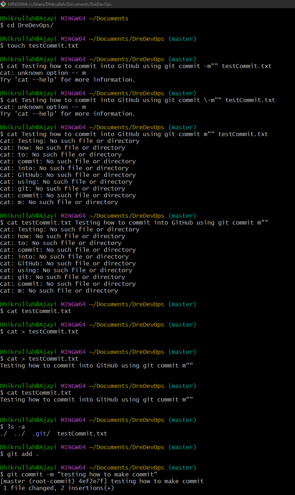
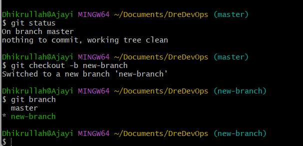
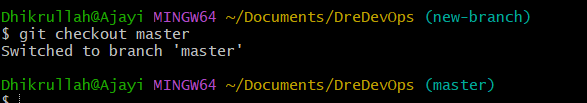
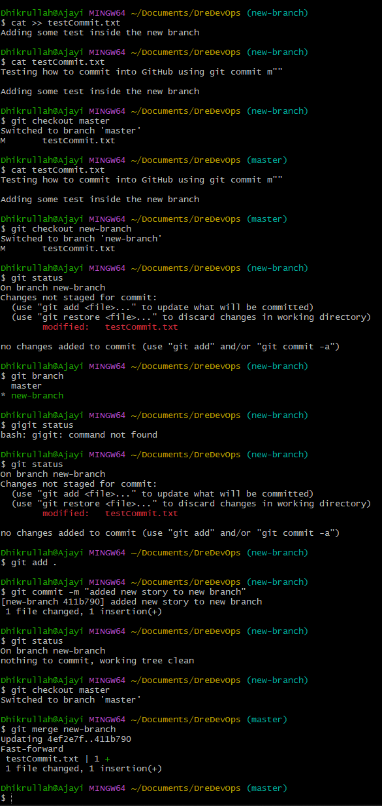
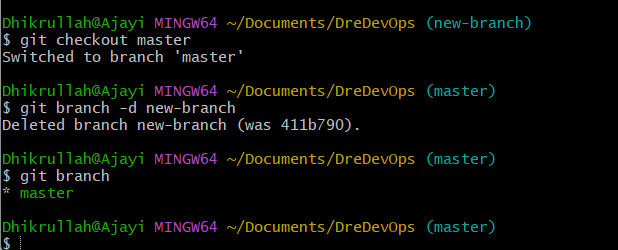
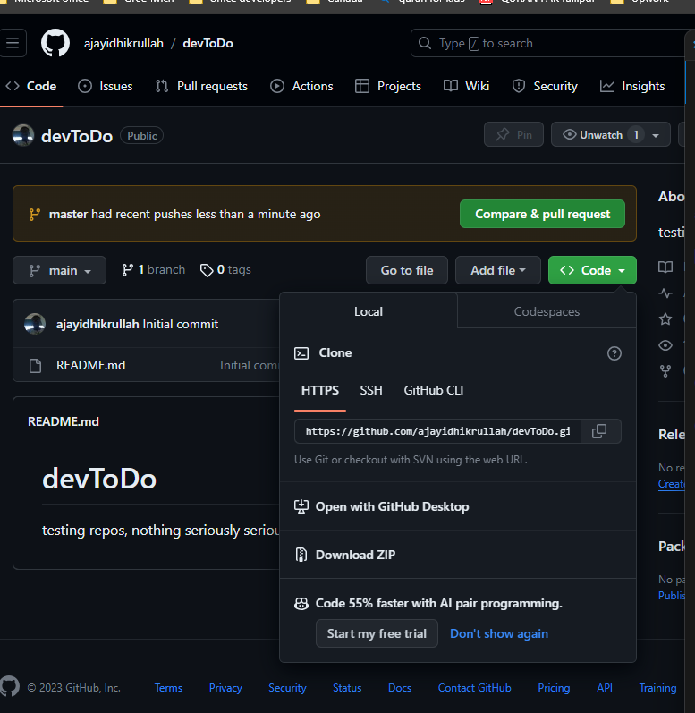
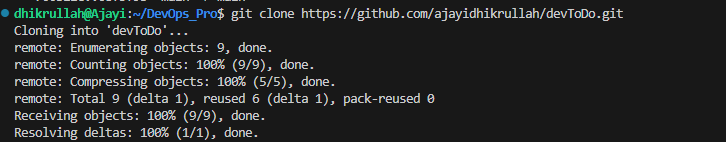

#   **Initializing Git repo and Committing changes**:

##  **what Git is about**
    Git is seen as a distributed version control system, which allows developers, content developers to collaborate, share and keep changes of their codes/documentations respectively.
    In Git, you can keep codes, keep previous versions (version control), merge changes with another user etc.

##  **Git initialization**:
    To iniailize a git repo for the first time, one needs to have installed git via Git Install or just use https://git-scm.com/downloads

    Let's initialize.
    1. Create a working drectory/folder
    2. Navigate to the directory
    3. Run the ```git init``` command to initialize. as shown below.
    
    

##  **First commit**
    commit is adding some wordings to your code to show what it does and make it easy to understand what the push is about.

    1. Create any file in the directory above where we initialized.
    2. Write to the file
    3. Add your changes by using ```git add .```
    4. Now commit as shown below
    

    The `-m` flag is a parameter to pass in the commit message

## **Now, let's Branch**
    Branching allows to create multiple copy of source code, this allows to have a personal copy of the source code, then you can merge them in a main branch.
    Branch also help to avoid errors/conflict when merging from all 

    

    **Git Checkout and Branch to Old branch**
    use ```git checkout [branchName]```
    

## **Gir Merge**
    Basically, you would have different branches, and at the end, you can merge those branch to a folder OR usually called, a Main or Master branch.

    to merge use ```git merge new-branch``` inside of the _master branch_
    

## **Deleting a Branch**
    Usually, the branch must have been pushed, tested and merged to the main or master branch before we delete, else, your changes are gone, _oti loo_, although, sometimes, we can have an error or unused branch, so we can always delete, but be sure it is not useful again.

    - to delete a branch, stay out of the branch to the main branch ot anyother branch, and do the following

    ```git branch -d [branch-name]```
    

##  **Remote Repository**
    **Already I have my repository and GitHub account ready**
    - Here, we will be creating a new Repo in GitHub
    - Add the local codebase to the online repo.
    - Remote clone and pull.

    

    - Add the remote origin

    

    **Git clone**
    clone by using ```git clone [repo URL]```

    As shown:
    
