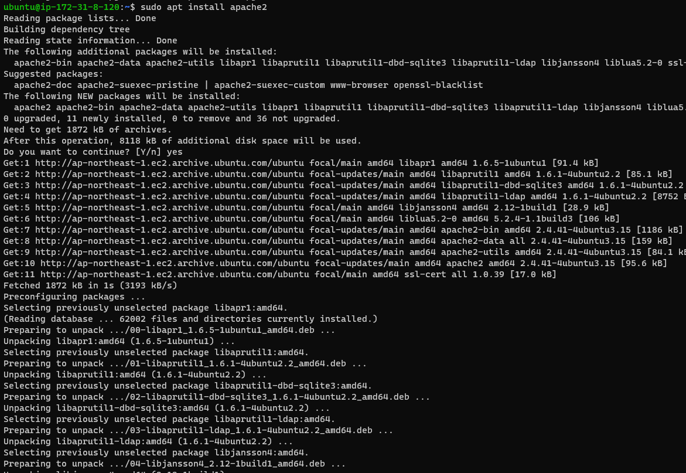
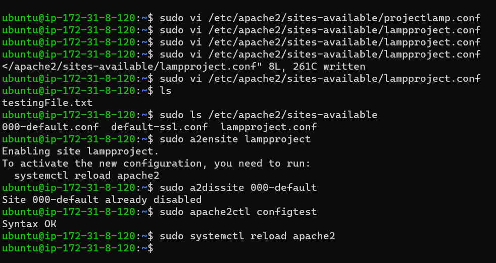

#   LAMP - Linux, Apache, MySQL, PHP, Python, or Perl

    This is designed to build web applications using LAMP stack. Create dyanmic web apps using Linux, Apache,, MySQL and PHP
    Advanced topics in LAMP are system performance and optimization, debugging, and deployment
    LAMP stack will equip you to build robust, scalable and secured web apps

1.  **PreRequisites:**
    - AWS fre tier account has been created initially
    - EC2 instance running on VM
    - Ubuntu on Windows OS running as expected

    - Connecting to EC2 instance using terminal

    ```console
        ssh -i private-key-name.pem ubuntu@yourPublicIPaddress
        ssh -i "deenet-keypair-EC2.pem" ubuntu@ec2-52-xxx-78-218.ap-northeast-1.compute.amazonaws.com
    ```

    
    

2.  **Installing Apache and Updating the Firewall**
    apache is an open source web server software, it runs on 67% of all web servers in the world.
    it is fast and reliable, secured. it can be customized to meet the needs of many different environment by using extensions
    Most of the Wordpress websites hosting providers you see are using Apache as their we server.
    We have siomilar web servers such as NGINX, Microsoft IIS,etc

    - Update a list of pacjages in package manager.
    - Once you connect to the 

    ```console
        sudo apt update //update a list of the packages
        sudo apt install apache2 //running apache2 installation.
        launch the Apache server with the public IPv4 address 13.231.225.31
    ```
    
    
    
    
    
    

##  **Installing MySQL**
3.  Now, we have an Ubuntu readymade web page served.
    We need to install MySQL inside of the Apache server we served earlier. Heres how to achieve that.
    - We can secure our DB by runing a security query - SQL, using the Alter SQL query, and change to set the password.
    - to exit SQL - just type exit.
    - We can further validate Password, however, I will not do that!!!
    ```console
        sudo apt install mysql-server>>>press Y and then Enter
        Login to Mysql after Installation - sudo mysql - it connect the Mysql server with the Admin database user root level as we ran it with SUDO.
        security -> ALTER USER 'root'@'localhost' IDENTIFIED WITH mysql_native_password BY 'Pass******(*&*&%)';
        Note: there are 3 levels of Mysql password validation.
        - LOW Length >= 8
        - Medium length >= 8, numeric, mixed case and special characters
        - Strong length >= 8, numeric mixed case, special characters and dictionaries
        Enter 0 = LOW, 1 = MEDIUM and 2 = STRONG: 1 //'passw0rd1!2'
    ```
    
    
    
    

##  **Let's Install PHP**
4.  PHP is a serverside language, backend web development to interact with users and data. PHP allows Website or softwares 
    to fetch 
    users queries based on request.

    ```console
    Installing PHP and other dependencies -  sudo apt install php libapache2-mod-php php-mysql
    php -v //check version of PHP a backend language, just like C#, Python etc
    
    ** The LAMP stack is almost done such as
    - Linux(Ubuntu)
    - ApacheHTTPserver
    - MySQL
    - PHP

    At this piint, it is best to have a proper Apache Virtual Host to hold the websites files and folders, etc. Virtual host allows you to have many or multiple websites that is sitted in a single machine and users of websites will NEVER notice.
    ```
    
    
    

## **Configure first Virtual Host | Enabling PHP on Website**
5.  Configuring our PHP

    ```console
        editing Directory in Apache Linux - sudo nano /etc/apache2/mods-enabled/dir.conf
        Reloading Apache after changes - $ sudo systemctl reload apache2
        Create a config for Apache Project Lamp - nano or vim /etc/apache2/sites-available/lampproject.conf

    ```
    
    
## **Create Virtual Host for Website using Apache**
6.  Website name would be lampproject - this can be anything domain of our choice.
    Directory is /var/www/html directory

    ```console
        sudo mkdir /var/www/projectlamp
        assign ownership or right - $ sudo chown -R $USER:$USER /var/www/projectlamp
        Enbaling new virtual host - $ sudo a2ensite projectlamp
        disabling default Apaches websites with - sudo a2dissite 000-default
        Check if NO syntax Error - $ sudo apache2ctl configtest
        Reload Apache to take Effect - $ sudo apache2ctl configtest
        
    ```
    .png)
    
    